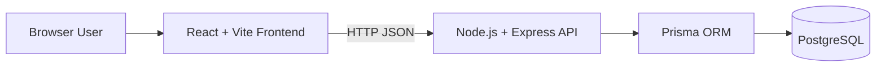

# Architecture

SkillSync is a React frontend backed by an Express API. Prisma provides the database access layer and PostgreSQL stores questions and metadata.

## Runtime Responsibilities

- **React + Vite:** renders the Library and Admin workflows, validates spreadsheet input, and calls the API.
- **Node.js + Express:** exposes question CRUD and batch import endpoints, handles CORS, health checks, and structured logging.
- **Prisma:** maps the application model to PostgreSQL and provides typed queries and transactions.
- **PostgreSQL:** persists questions, answers, classifications, skills, roles, and experience metadata.

## Local Containers

`docker-compose.yml` starts PostgreSQL first, waits for its health check, then starts the backend and frontend. PostgreSQL data is persisted in the `postgres_data` named volume.
